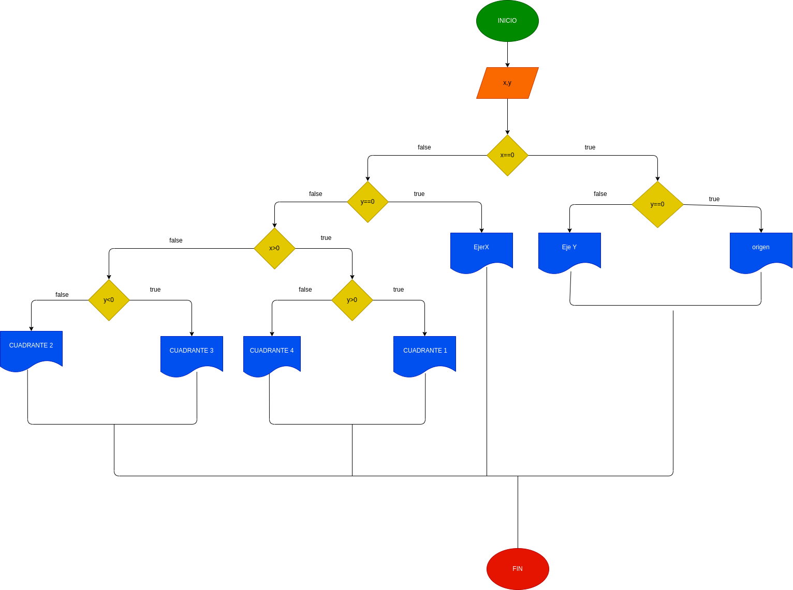

# taller_condicionales
programa que lee las cordenadas cartesianas (y,x) de un punto en el plano y saber en que cuadrante se encuentra o saber si el punto esta sobre de un eje
# diagrama de flujo 

